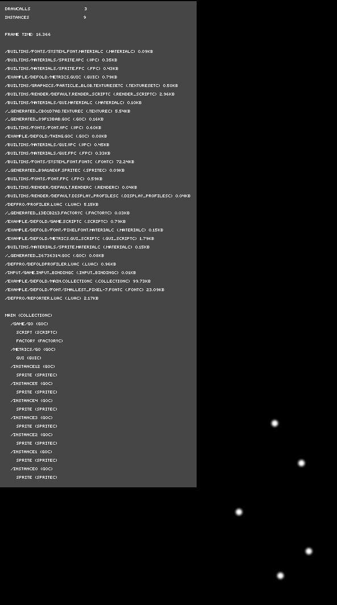

# DefPro
The Defold Profiler project provides a way to interact with the Defold profiler using Lua. It can be used inside a running Defold game to show a profiler overlay (much like the existing [visual profiles](http://www.defold.com/manuals/debugging/#_visual_profiler)) with key metrics such as FPS, instance and draw call count. It is also possible to use this from the command line to pull profiler data from a running Defold game in much the same way as the [web profiler](http://www.defold.com/manuals/debugging/#_web_profiler). This is useful if you wish to get key metrics and send them off to some other system or as part of automated testing to verify that certain values do not go above defined thresholds.

# Requirements
### From Defold
When using this project from within Defold the only thing you need to do is to include this project as a [library dependency](http://www.defold.com/manuals/libraries/). Add this to your dependencies in game.project to get the latest version:

	https://github.com/britzl/defpro/archive/master.zip

### From command line
When running from the command line you need to use a Lua version with bit wise operations enabled (LuaJit or Lua 5.2+). You also need [LuaSocket](http://w3.impa.br/~diego/software/luasocket/).

# Examples
### From Defold
Check examples/defold for an example of how to get and display profiler data from within a running Defold app.

### From command line
Check examples/commandline for an example of how to get and display profiler data from the command line. Run the example like this:

	lua example/commandline/capture.lua

Make sure to have a Defold app running!

